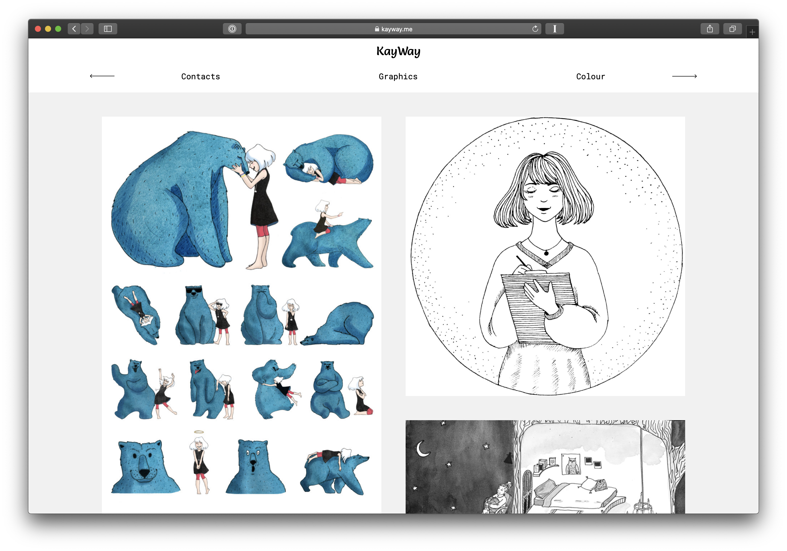

<center>
  <a href="https://kayway.me" target="_blank">
    
  </a>
</center>

# [kayway.me](https://kayway.me)

> Portfolio website for my wife

## Requirements

- [Node.js](https://nodejs.org/en/) 16.x

## Quick Start

```sh
$ npm i
$ npm run dev
$ open http://0.0.0.0:3000
```

## Build

```sh
$ npm run build
$ npm start
$ open http://0.0.0.0:3000
```

---

MIT © [John Grishin](http://johngrish.in)
